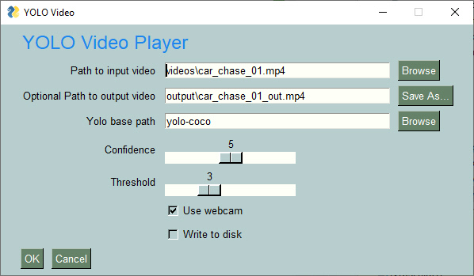

<p align="center">
  <p align="center"><p>

  <h2 align="center">psgyolo</h2>
  <h2 align="center">A PySimpleGUI Application</h2>
</p>

PySimpleGUI openCV YOLO Deep Learning GUI

<p align="center"><p>


<p align="center"><p>


## Features

* Shows how to create an AI object identification GUI application
* Identifies objects as per YOLO library
* Teaches going from a command line OpenCV application to an entirely window-based
* Use as a starting point for other AI projects that are command line projects
## Installation

### Using PIP with PyPI

The latest official release of PySimpleGUI products can be found on PyPI.  To pip install the demo applications from PyPI, use this command

#### If you use the command `python` on your computer to invoke Python (Windows):

`python -m pip install --upgrade psgyolo`

#### If you use the command `python3` on your computer to invoke Python (Linux, Mac):

`python3 -m pip install --upgrade psgyolo`

### Using PIP with GitHub

You can also pip install the PySimpleGUI Applications that are in the PySimpleGUI GitHub account.  The GitHub versions have bug fixes and new programs/features that have not yet been released to PyPI. To directly pip install from that repo:

#### If you use the command `python` on your computer to invoke Python (Windows):

```bash
python -m pip install --upgrade https://github.com/PySimpleGUI/psgyolo/zipball/main
```

#### If you use the command `python3` on your computer to invoke Python (Linux, Mac):

```bash
python3 -m pip install --upgrade https://github.com/PySimpleGUI/psgyolo/zipball/main
```

## Usage

Once installed, launch psgyolo by typing the following in your command line:

`psgyolo`

## Running the Demos
  
You will need to pip install openCV and PySimpleGUI
```
pip install opencv-python
pip install pysimplegui
```

Run any of the .py files in the top level directory:
```
yolo.py - single image processing
yolo_video.py Video display
yolo_video_with_webcam.py - webcam or file source. Option to write to hard drive
```
And you'll need the training data.  It's 242 MB and too large for GitHub:
https://www.dropbox.com/s/uf00d4ov6fmw0he/yolov3.weights?dl=1

## Learn More

This code has an article associated with it that will step you through the code (minus GUI part).

https://www.pyimagesearch.com/2018/11/12/yolo-object-detection-with-opencv/


## Acknowledgements
This software is provided by Dr. Adrian Rosebrock of the pyimagesearch organization.
https://www.pyimagesearch.com

## License & Copyright

Copyright 2023-2024 PySimpleSoft, Inc. and/or its licensors.

This is a free-to-use "Utility" and is licensed under the
PySimpleGUI License Agreement, a copy of which is included in the
license.txt file and also available at https://pysimplegui.com/eula.

Please see Section 1.2 of the license regarding the use of this Utility,
and see https://pysimplegui.com/faq for any questions.


## Contributing

We are happy to receive issues describing bug reports and feature
requests! If your bug report relates to a security vulnerability,
please do not file a public issue, and please instead reach out to us
at issues@PySimpleGUI.com.

We do not accept (and do not wish to receive) contributions of
user-created or third-party code, including patches, pull requests, or
code snippets incorporated into submitted issues. Please do not send
us any such code! Bug reports and feature requests should not include
any source code.

If you nonetheless submit any user-created or third-party code to us,
(1) you assign to us all rights and title in or relating to the code;
and (2) to the extent any such assignment is not fully effective, you
hereby grant to us a royalty-free, perpetual, irrevocable, worldwide,
unlimited, sublicensable, transferrable license under all intellectual
property rights embodied therein or relating thereto, to exploit the
code in any manner we choose, including to incorporate the code into
PySimpleGUI and to redistribute it under any terms at our discretion.
